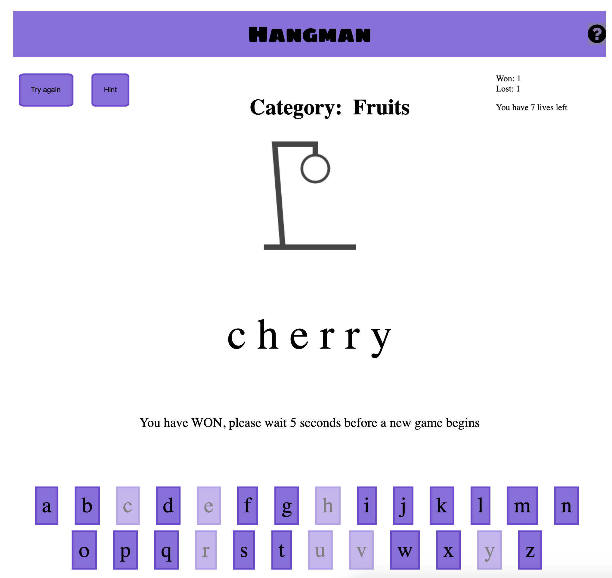

# Hangman 

## How to Play
According to the randomly generated category when you open this Hangman game the player is to try to guess the word by selecting what letters it contains, using the on-screen keyboard. However, every wrong guess brings them one step closer to losing. 

A complete rendering takes nine moves.

## Tips and Tricks to playing:

1. Select the vowels first - a, e, i, o, u & y.
2. Next, you probably graduated to learning that not all letters are used equally. It’s rare that the letter ‘Q’ appears in a word, whereas ‘T’ is used a lot more often.
Once you get just a couple of letters of in a hangman puzzle, the game becomes easier. The solution set is drastically reduced, and skills like pattern matching and word knowledge become important. It’s crucial to get that first letter in the puzzle as soon as possible. Which letter should you guess first?

For some more interesting snippets on theories on how to master a Hangman game [click here.](http://datagenetics.com/blog/april12012/index.html)

## Technologies used:

1. HTML
2. CSS
3. Javascript
4. JQuery

## Next Steps

1. Complete "Hint" Feature
2. Complete "Info" Button
3. Add Sound effects and toggle
4. Add multi player mode that users can input their own words
5. Add player vs computer mode
6. Allow selection of category
7. Connect a dictonary API to have an larger selection of words based on a category
8. Clean up code in JS from line 226-306 to condense it to a loop.

## Credits
1. [Canvas Code Credits](https://codepen.io/xavier_bs/pen/MMNGyG?editors=0010)

